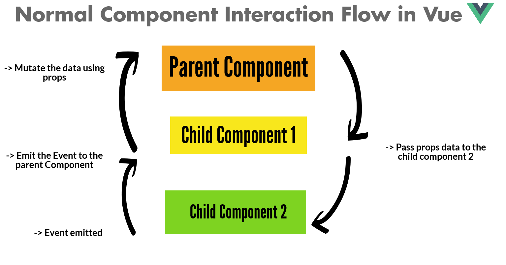

# Vue.js Starting Guide

# Vue란 무엇인가?

- <a href = "https://012.vuejs.org/guide/">Concepts Overview</a>

  

- MVVM패턴의 뷰모델 레이어에 해당하는 View 라이브러리
- DOM Listenters, DataBindings 로 구성
- HTML(DOM)에서 조작 -> 리스너가 listen -> JavaScript Obj 변경
- JavaScript Obj 변경 -> Data binding -> DOM반영

# 기존의 웹 프론트 엔드 개발

- 기존의 웹 프론트엔드 개발은 HTML, CSS, JavaScript를 사용해왔음

  ```html
  <!DOCTYPE html>
  <html lang="en">
    <head>
      <meta charset="UTF-8" />
      <meta http-equiv="X-UA-Compatible" content="IE=edge" />
      <meta name="viewport" content="width=device-width, initial-scale=1.0" />
      <title>Document</title>
    </head>
    <body>
      <div id="app"></div>

      <script>
        var div = document.querySelector("#app");
        var string = "hello world";
        console.log(div);
        div.innerHTML = "hello World!!!";
      </script>
    </body>
  </html>
  ```

- html은 DOM을 구성, JavaScript는 DOM을 조작
- 대부분의 값들은 변수로 이루어져 있으며 해당 값을 참조하게 됨. (하드코딩 X)
- 해당 코드에서 string값을 바꾼다고 하면 내용이 반영될까? -> X
- 아래와 같이 다시 오브젝트를 접근해서 값을 변경해줘야지만 값이 바뀜

  ```html
  <script>
    var div = document.querySelector("#app");
    console.log(div);

    var string = "hello world";
    div.innerHTML = string;

    var string = "hello world!!";
    div.innerHTML = string;
  </script>
  ```

- 이를 해결하자! -> 개발된 수많은 프론트엔드 라이브러리들

# Reactivity

- <a href="https://developer.mozilla.org/en-US/docs/Web/JavaScript/Reference/Global_Objects/Object/defineProperty">Object.defineProperty()</a>

  - The static method Object.defineProperty() defines a new property directly on an object, or modifies an existing property on an object, and returns the object.
  - 객체의 특정 속성 동작을 재정의 하는 API
    ```html
    Object.defineProperty('대상객체', 객체의 속성, { 정의할 내용 })
    ```
  - Reactivity 사용
    ```html
    <!DOCTYPE html>
    <html lang="en">
      <head>
        <meta charset="UTF-8" />
        <meta http-equiv="X-UA-Compatible" content="IE=edge" />
        <meta name="viewport" content="width=device-width, initial-scale=1.0" />
        <title>Document</title>
      </head>
      <body>
        <div id="app"></div>
        <script>
          var div = document.querySelector("#app");
          var viewModel = {};
          /*
            Object.defineProperty('대상객체', 객체의 속성, {
                정의할 내용
            })
          */
          Object.defineProperty(viewModel, "str", {
            //속성에 접근했을때 동작 정의
            get: function () {
              console.log("접근");
            },
            //속성의 값을 할당했을때 동작 정의
            set: function (newValue) {
              console.log("할당", newValue);
              div.innerHTML = newValue;
            },
          });
        </script>
      </body>
    </html>
    ```
    ```log
    viewModel.str = "hi"
    vue-way.html:26 할당 hi
    'hi'
    viewModel.str = "hi!!!"
    vue-way.html:26 할당 hi!!!
    'hi!!!'
    ```
  - Reactivity 라이브러리화

    - 즉시실행 함수를 활용, init과 render를 application logic에 노출되지 않도록 또다른 scope에 넣어줌.
    - 일반적인 오픈소스 라이브러리의 작성법 중 하나.

    ```html
    <body>
      <div id="app"></div>
      <script>
        var div = document.querySelector("#app");
        var viewModel = {};

        //즉시실행
        (function () {
          function init() {
            Object.defineProperty(viewModel, "str", {
              //속성에 접근했을때 동작 정의
              get: function () {
                console.log("접근");
              },
              //속성의 값을 할당했을때 동작 정의
              set: function (newValue) {
                console.log("할당", newValue);
                render(newValue);
              },
            });
          }

          function render(value) {
            div.innerHTML = value;
          }

          init();
        })();
      </script>
    </body>
    ```

# Vue를 활용한 Reactivity

- Vue 라이브러리를 활용하여 Reactivity를 구현

  ```html
  <!DOCTYPE html>
  <html>
    <head>
      <meta charset="utf-8" />
      <meta name="viewport" content="width=device-width, initial-scale=1.0" />
      <title>Getting Started</title>
    </head>
    <body>
      <div id="app">{{ message }}</div>

      <script src="https://cdn.jsdelivr.net/npm/vue/dist/vue.js"></script>
      <script>
        new Vue({
          el: "#app",
          data: {
            message: "Hello Vue!",
          },
        });
      </script>
    </body>
  </html>
  ```

# 뷰 인스턴스와 컴포넌트

- <a href="https://012.vuejs.org/api/">인스턴스</a>

  - 생성자 함수

    ```html
    new Vue();
    ```

    - 인스턴스 옵션

    ```html
    new Vue({ el:, template:, data:, methods:, created:, watch: });
    ```

    ```html
    <body>
      <div id="app"></div>
      <script src="https://cdn.jsdelivr.net/npm/vue/dist/vue.js"></script>
      <script>
        var vm = new Vue({
          el: "#app",
          data: {
            message: "hi",
          },
          methods: {},
        });
      </script>
    </body>
    ```

- <a href="https://012.vuejs.org/guide/#Components">컴포넌트</a>

  - In Vue.js, every component is simply a Vue instance. Components form a nested tree-like hierarchy that represents your application interface.
  - 재사용성이 올라가고 코드를 최소화 가능
    
  - 인스턴스 생성시 기본적으로 root component로 생성
  - 컴포넌트 등록
    ```html
    Vue.component("컴포넌트 이름", 컴포넌트 내용);
    ```
  - 전역 컴포넌트

    ```html
    <body>
      <div id="app">
        <app-header> </app-header>
        <app-content></app-content>
      </div>

      <script src="https://cdn.jsdelivr.net/npm/vue/dist/vue.js"></script>
      <script>
        //전역컴포넌트
        Vue.component("app-header", {
          template: "<h1>Header</h1>",
        });

        Vue.component("app-content", {
          template: "<div>content</div>",
        });

        new Vue({
          el: "#app",
        });
      </script>
    </body>
    ```

  - 지역 컴포넌트

    ```html
    new Vue({ el : "#app", components: { 'app-footer' : { template : "
    <footer>footer</footer>
    " } } });
    ```

  - 전역컴포넌트와 인스턴스의 관계
    - 전역 컴포넌트의 경우 모든 인스턴스에 대해 모든 컴포넌트가 적용
    - 지역 컴포넌트의 경우 인스턴스 하나에 설정된 컴포넌트들만 적용
    - 보통 지역 컴포넌트를 사용함

- Components Sample Code

  ```html
  <!DOCTYPE html>
  <html lang="en">
    <head>
      <meta charset="UTF-8" />
      <meta http-equiv="X-UA-Compatible" content="IE=edge" />
      <meta name="viewport" content="width=device-width, initial-scale=1.0" />
      <title>Document</title>
    </head>
    <body>
      <div id="app">
        <app-header> </app-header>
        <app-content></app-content>
        <app-footer></app-footer>
      </div>
      <div id="app2">
        <!-- 전역으로 선언한 컴포넌트 출력 -->
        <app-header> </app-header>
        <!-- 지역으로 선언한 컴포넌트는 출력되지 않음 -->
        <app-footer></app-footer>
      </div>

      <script src="https://cdn.jsdelivr.net/npm/vue/dist/vue.js"></script>
      <script>
        //전역컴포넌트
        Vue.component("app-header", {
          template: "<h1>Header</h1>",
        });

        Vue.component("app-content", {
          template: "<div>content</div>",
        });

        //지역 컴포넌트
        new Vue({
          el: "#app",
          components: {
            "app-footer": {
              template: "<footer>footer</footer>",
            },
          },
        });

        new Vue({
          el: "#app2",
          components: {},
        });
      </script>
    </body>
  </html>
  ```

# 컴포넌트 통신 방식

- 뷰 컴포넌트는 각각의 고유한 데이터 유효 범위를 가짐
- 컴포넌트간 데이터를 주고받기 위해서는 특정한 "규칙"을 따라야 함
- 규칙(rules)
  - 상위 -> 하위 : 프롭스 (props)
  - 하위 -> 상위 : 이벤트 (event)
    <a href="https://dzone.com/articles/how-do-components-interact-in-vue-and-what-is-vuex"></a>
- 컴포넌트 통신방식이 필요한 이유
  - 특정 컴포넌트의 변화에 따라 다른 컴포넌트가 유기적으로 데이터를
    주고받았을때 데이터의 흐름을 예측하기 어려움 (MVC 패턴)
  - 프롭스, 이벤트만 사용하므로 데이터의 흐름을 추적하기가 용이해짐 (버그, 디버깅의 유리함. 유지보수의 편리함)

# Props (상위 -> 하위)
```html
<!DOCTYPE html>
<html lang="en">
  <head>
    <meta charset="UTF-8" />
    <meta http-equiv="X-UA-Compatible" content="IE=edge" />
    <meta name="viewport" content="width=device-width, initial-scale=1.0" />
    <title>Document</title>
  </head>
  <body>
    <div id="app">
      <app-header v-bind:propsdata="message"></app-header>
      <app-content v-bind:propsdata="num"></app-content>
      <app-footer v-bind:propsdata="res"></app-footer>
    </div>
    <script src="https://cdn.jsdelivr.net/npm/vue/dist/vue.js"></script>
    <script>
      var app_header = {
        template: "<h1>{{ propsdata }}</h1>",
        //root data to props
        props: ['propsdata']
      }

      var app_content = {
        template: "<h1>{{ propsdata }}</h1>",
        //root data to props
        props: ['propsdata']
      }

      var app_footer = {
        template: "<h1>{{ propsdata }}</h1>",
        //root data to props
        props: ['propsdata']
      }

      new Vue({
        el: '#app',
        components: {
          'app-header' : app_header,
          'app-content' : app_content,
          'app-footer' : app_footer
        },
        data: {
          //root data
          message : 'hi',
          num : 10,
          res : "ok"
        }
      })
    </script>
  </body>
</html>
```
# Event Emit (하위 -> 상위)

```html
<!DOCTYPE html>
<html lang="en">
<head>
  <meta charset="UTF-8">
  <meta http-equiv="X-UA-Compatible" content="IE=edge">
  <meta name="viewport" content="width=device-width, initial-scale=1.0">
  <title>Document</title>
</head>
<body>
  <div id="app">
    <p>{{ num }}</p>
    <!-- <app-header v-on:하위컴포넌트에서 발생한 이름="상위컴포넌트의 메서드 이름"></app-header> -->
    <app-header v-on:pass="logText">
    </app-header>
    <app-content v-on:add="increaseNum"></app-content>
  </div>
  <script src="https://cdn.jsdelivr.net/npm/vue/dist/vue.js"></script>
  <script>
    var app_header = {
      template: '<button v-on:click="passEvent">click me</buttion>',
      methods : {
        passEvent : function() {
          this.$emit('pass');
        }
      }
    }
    var app_content = {
      template: '<button v-on:click="addEvent">add</buttion>',
      methods : {
        addEvent : function() {
          this.$emit("add")
        }
      }
    }

    new Vue({
      el: '#app',
      components: {
        'app-header' : app_header,
        'app-content' : app_content
      },
      methods : {
        logText: function() {
          console.log('hi');
        },
        increateNum: function() {
          this.num ++;
          console.log(this.num)
        }
      },
      data : {
        num : 10
      }
    })
  </script>
</body>
</html>
```

## Vue에서의 this 사용
일반적인 object에서의 this
```html
obj = {
  num : 10,
  getNum : function() {
    console.log(this.num);
  }
}
```
뷰에서의 this (num의 위치에 유의. 일반적으로는 data 내부에있으므로 참조 불가) data안에 선언하였지만 외부 레벨로 뷰 자체가 설정하므로 사용 가능
```html
new Vue({
  el : "",
  data : {
    num : 10
  },
  method : {
    getNum : function() {
      console.log(this.num);
    }
  }
})
```
# 동 컴포넌트 레벨에서의 통신방법
1. event를 사용하여 부모레벨로 전송
2. 부모레벨에서 데이터를 수신
3. 부모레벨에서 props를 통해 자식레벨로 전송

ex) app-content (event)-> root (props)-> app-header

```html
  <!DOCTYPE html>
  <html lang="en">
  <head>
    <meta charset="UTF-8">
    <meta http-equiv="X-UA-Compatible" content="IE=edge">
    <meta name="viewport" content="width=device-width, initial-scale=1.0">
    <title>Document</title>
  </head>
  <body>
    <div id="app">
      <app-header v-bind:propsdata="num"></app-header>
      <app-content v-on:pass="deliverNum"></app-content>
    </div>
    <script src="https://cdn.jsdelivr.net/npm/vue/dist/vue.js"></script>
    <script>
      var app_header = {
        template : '<div>header<br><p>{{ propsdata }}</p><div>',
        props: ['propsdata']
      }
      var app_content = {
        template : '<div>content<br><button v-on:click="passNum">pass</button><div>',
        methods : {
          passNum : function(){
            this.$emit('pass', 10)
          }
        },
      }

      new Vue({
        el: '#app',
        data : {
          num : 0
        },
        methods: {
          deliverNum : function(value){
            this.num = value;
          }
        },
        components: {
          'app-header': app_header,
          'app-content': app_content
        }
      })
    </script>
  </body>
  </html>
```
# 뷰 라우터
페이지를 이동할때 사용하는 라이브러리
  - npm
    ```sh
    npm install vue-router
    ```
    ```js
    import Vue from 'vue'
    import VueRouter from 'vue-router'
    Vue.use(VueRouter)
    ```
  - yarn
    ```sh
    yarn add vue-router
    ```
  - CDN
    ```html
    <!-- for lst version -->
    <script src="https://unpkg.com/dist/vue-router.js">
    // use for Vue2
    <script src="https://unpkg.com/vue-router@3.5.3/dist/vue-router.js">
    ```
라우터 정의
  ```js
  var router = new VueRouter({
      //페이지의 라우팅 정보
      //어떤 url -> 어떤 페이지 -> 배열로
      routes: [
        {
          //페이지의 url
          path: '',
          //해당 url에서 표시될 컴포넌트
          component: LoginComponent,
        },
        {
          path: '',
          component: MainComponent,

        }
      ]
    });
  ```
라우터 등록
```js
new Vue({
      el: "#app",
      //라우터 연결
      router: router
    });
```
라우터링크
url변경시 route속성에 따라 컴포넌트가 화면에 출력됨
```html
<div>
  <router-link to="/login">Login</router-link>
  <router-link to="/main">Main</router-link>
</div>
```
Example
  ```html
  <!DOCTYPE html>
  <html lang="en">
  <head>
    <meta charset="UTF-8">
    <meta http-equiv="X-UA-Compatible" content="IE=edge">
    <meta name="viewport" content="width=device-width, initial-scale=1.0">
    <title>Document</title>
  </head>
  <body>
    <div id="app">
      <div>
        <router-link to="/login">Login</router-link>
        <router-link to="/main">Main</router-link>
      </div>
      <router-view></router-view>
    </div>
    <script src="https://cdn.jsdelivr.net/npm/vue/dist/vue.js"></script>
    <script src="https://unpkg.com/vue-router@3.5.3/dist/vue-router.js"></script>
    <script>
      var LoginComponent = {
        template: "<div>login</div>"
      }
      var MainComponent = {
        template: "<div>main</div>"
      }

      var router = new VueRouter({
        //페이지의 라우팅 정보
        //어떤 url -> 어떤 페이지 -> 배열로
        routes: [
          {
            //페이지의 url
            path: '/login',
            //해당 url에서 표시될 컴포넌트
            component: LoginComponent,
          },
          {
            path: '/main',
            component: MainComponent,

          }
        ]
      });

      new Vue({
        el: "#app",
        //라우터 연결
        router: router
      });

    </script>
  </body>
  </html>
  ```
# Axios
Promise 기반 http통신 라이브러리. 비동기 웹 애플리케이션 제작에 사용됨.

vue-resource라는 라이브러리가 있었으나 더이상 사용하지 않음.

설치(CDN)
  ```html
  <script src="https://unpkg.com/axios/dist/axios.min.js"></script>
  ```
사용
  ```html
   <script>
    new Vue({
      el: '#app',
      data: {
        users: []
      },
      methods: {
        getData: function() { 
          var vm = this;
          axios.get('https://jsonplaceholder.typicode.com/users/')
            .then(function(response) {
              console.log(response.data);
              //this 사용에 유의할 것
              vm.users = response.data;
            })
            .catch(function(error) {
              console.log(error);
            });
        }
      }
    })
  </script>
  ```
예제
```html
<!DOCTYPE html>
<html lang="en">
<head>
  <meta charset="UTF-8">
  <meta name="viewport" content="width=device-width, initial-scale=1.0">
  <meta http-equiv="X-UA-Compatible" content="ie=edge">
  <title>Axios</title>
</head>
<body>
  <div id="app">
    <button v-on:click="getData">get user</button>
    <div>
      {{ users }}
    </div>
  </div>

  <script src="https://cdn.jsdelivr.net/npm/vue/dist/vue.js"></script>
  <script src="https://unpkg.com/axios/dist/axios.min.js"></script>
  <script>
    new Vue({
      el: '#app',
      data: {
        users: []
      },
      methods: {
        getData: function() { 
          var vm = this;
          axios.get('https://jsonplaceholder.typicode.com/users/')
            .then(function(response) {
              console.log(response.data);
              vm.users = response.data;
            })
            .catch(function(error) {
              console.log(error);
            });
        }
      }
    })
  </script>
</body>
</html>
```
